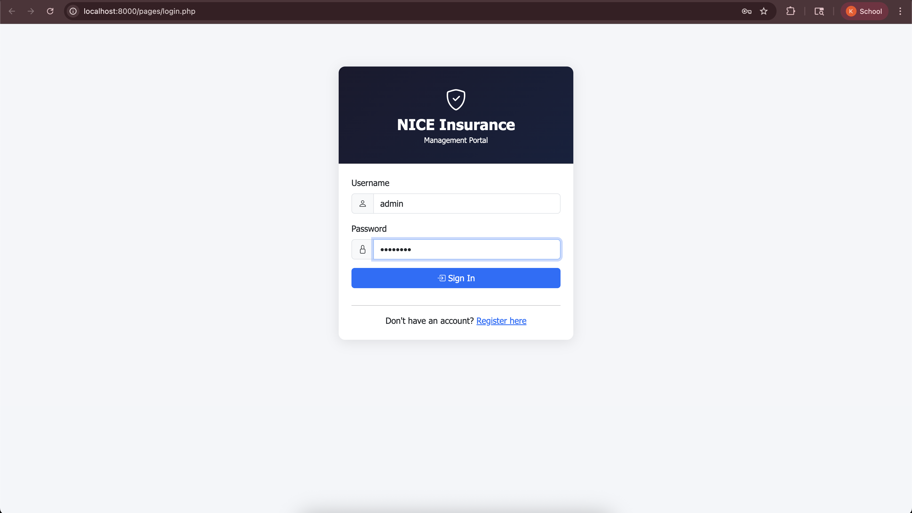
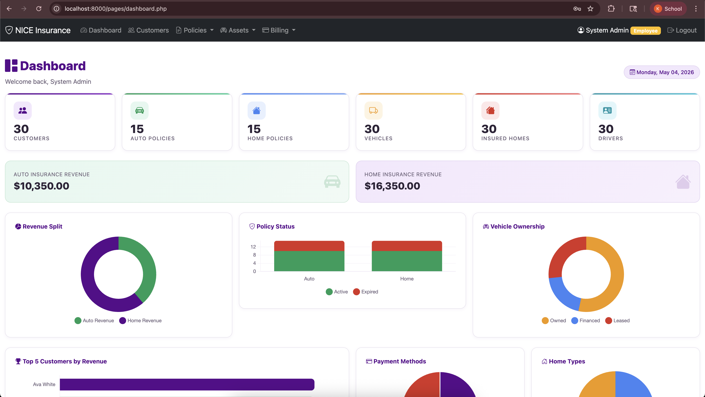
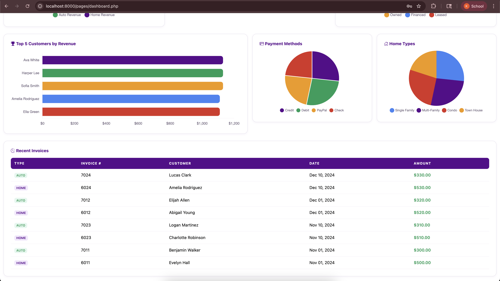
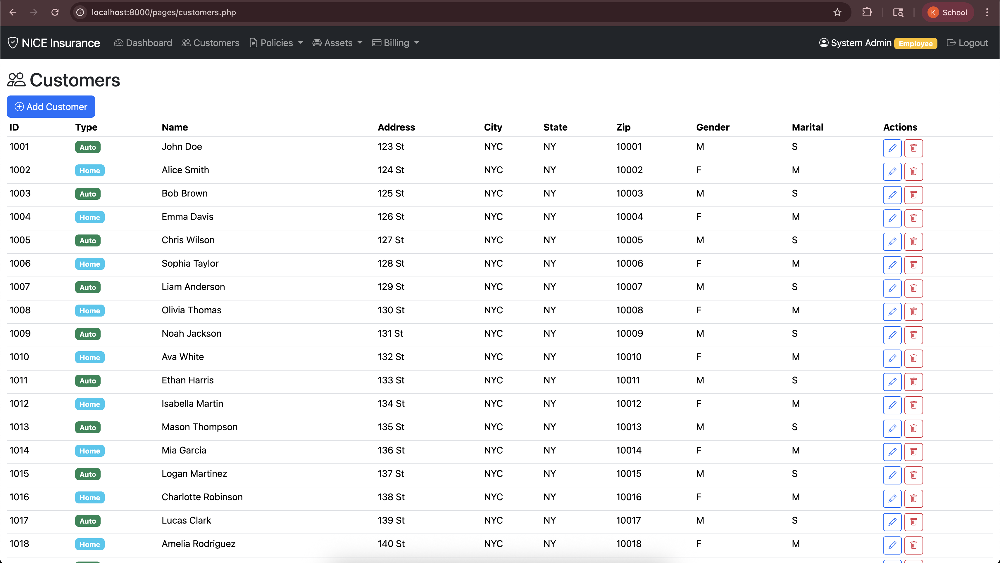
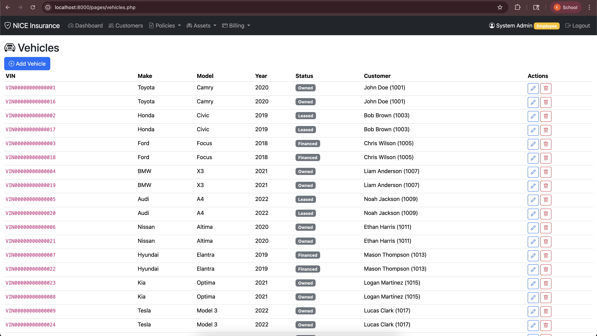
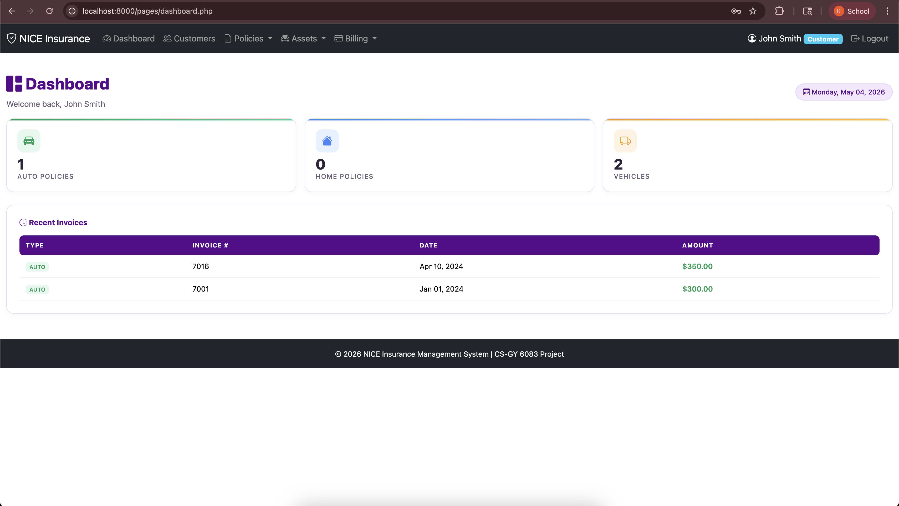
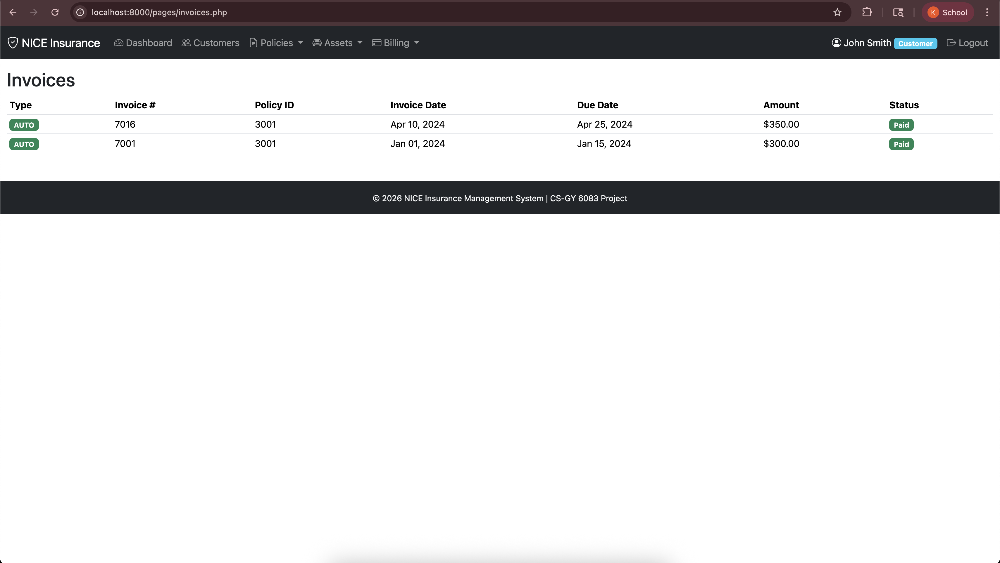
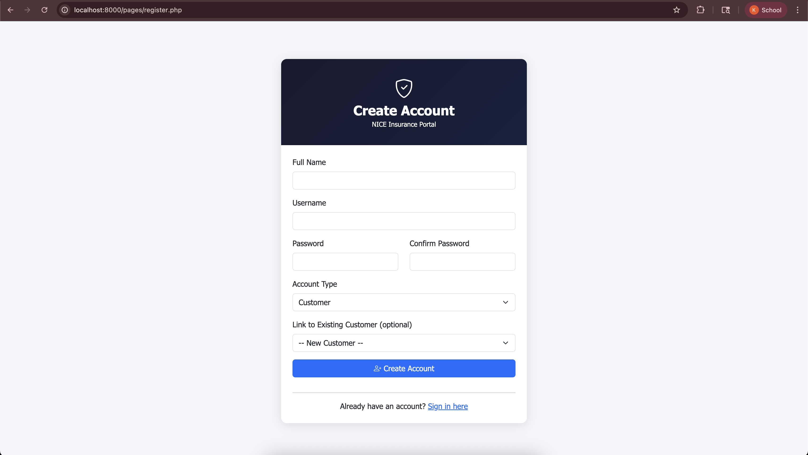

# NICE Insurance Management System

**A full-stack web application for managing insurance policies, customers, assets, and billing**  
Built with: PHP • MySQL • JavaScript • CSS

---

## 📸 Screenshots

### Login


### Admin Dashboard — KPIs & Analytics


### Admin Dashboard — Revenue & Invoices


### Customers — Full CRUD Management


### Vehicles — Asset Management


### Customer View — Role-Based Dashboard


### Invoices — Billing & Payment Status


### Registration


---

## 📌 About

NICE Insurance is a multi-role insurance management portal that allows employees to manage customers, policies, vehicles, homes, and billing — while giving customers a personalized view of their own policies and invoices.

---

## ✨ Features

- **Authentication** — Login, registration, and session-based auth
- **Role-Based Access** — Separate dashboards for Employee (admin) and Customer roles
- **Admin Dashboard** — KPIs, revenue metrics, and charts (revenue split, policy status, vehicle ownership, top customers, payment methods)
- **Customer Management** — Full CRUD with type tagging (Auto/Home)
- **Policy Management** — Auto and Home policies with active/expired status
- **Asset Management** — Vehicles (VIN, make, model, ownership status) and Homes (type, linked customer)
- **Billing & Invoices** — Invoice tracking with due dates and payment status (Paid/Unpaid)

---

## 🗂️ Project Structure

```
pages/      → PHP page files (dashboard, customers, vehicles, invoices, etc.)
includes/   → Shared components (header, nav, DB connection)
config/     → Database configuration
css/        → Stylesheets
js/         → JavaScript files
sql/        → Database schema and seed data
index.php   → Entry point
```

---

## 🛠️ Tech Stack

| Layer | Technology |
|---|---|
| Backend | PHP |
| Database | MySQL |
| Frontend | HTML, CSS, JavaScript |
| Charts | Chart.js |
| Auth | Session-based |

---

## 🚀 Running Locally

```bash
# Requirements: PHP 8+, MySQL, Apache (or XAMPP/MAMP)

# 1. Clone the repo
git clone https://github.com/KiranGhumare4021/NICE_Insurance_PDS.git
cd NICE_Insurance_PDS

# 2. Import the database
source sql/schema.sql
source sql/seed.sql

# 3. Configure database connection
# Edit config/db.php with your MySQL credentials

# 4. Start a local PHP server
php -S localhost:8000

# 5. Visit http://localhost:8000
```
